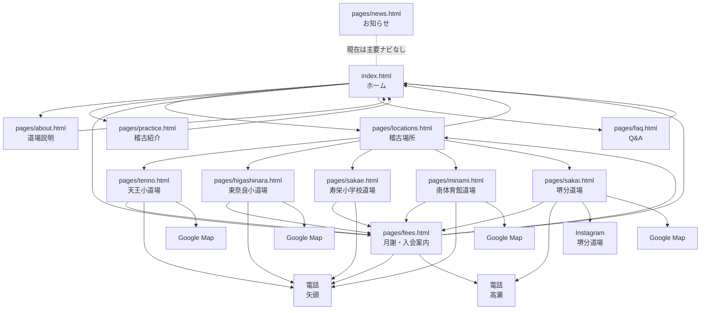
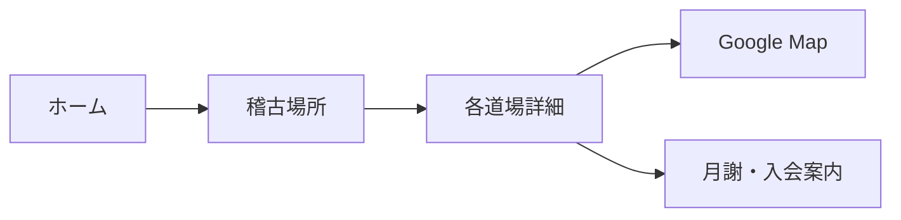
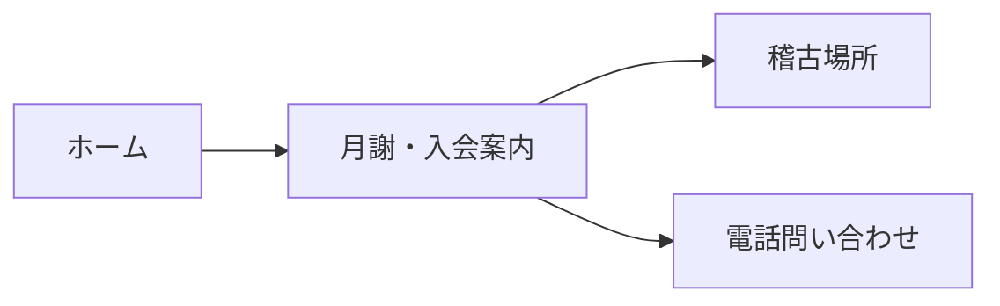

# ページ相関図・導線整理

## 現在のフォルダ構成

```text
/
├─ index.html            # トップページ
├─ pages/                # 下層ページ
├─ assets/css/styles.css # 共通CSS
├─ assets/images/        # 画像素材
└─ docs/                 # 構成メモ・運用資料
```

## 全体構成



## 主要ページの役割

| ページ | 役割 | 主な次の導線 |
| --- | --- | --- |
| `index.html` | サイト全体の入口。道場の概要、稽古場所、月謝、見学案内をまとめる | 道場説明、稽古紹介、稽古場所、月謝・入会案内、Q&A |
| `pages/about.html` | 道場の考え方、対象者、指導方針を伝える | 共通ナビから各主要ページ |
| `pages/practice.html` | 基本・形・組手・強化練習の内容を伝える | 共通ナビから各主要ページ |
| `pages/locations.html` | 各道場詳細へのハブ | 天王小、東奈良、寿栄、南体育館、堺分道場 |
| `pages/fees.html` | 月謝、入会金、見学・体験、連絡先を案内する | 稽古場所、電話問い合わせ |
| `pages/faq.html` | 入会前の不安やよくある質問を解消する | 共通ナビから各主要ページ |
| `pages/news.html` | お知らせ用ページ | 現在は主要ナビから未接続 |

## 道場詳細ページの役割

| ページ | 役割 | 連絡先 | 補足導線 |
| --- | --- | --- | --- |
| `pages/tenno.html` | 天王小道場の曜日・時間・場所案内 | 矢頭 | 月謝・入会案内、Google Map |
| `pages/higashinara.html` | 東奈良小道場の曜日・時間・場所案内 | 矢頭 | 月謝・入会案内、Google Map |
| `pages/sakae.html` | 寿栄小学校道場の曜日・時間・場所案内 | 矢頭 | 月謝・入会案内 |
| `pages/minami.html` | 南体育館道場の曜日・時間・場所案内 | 矢頭 | 月謝・入会案内、Google Map |
| `pages/sakai.html` | 堺分道場の曜日・時間・場所案内 | 高瀬 | 月謝・入会案内、Google Map、Instagram |

## ユーザーの想定フロー

### 初めて見る人

```mermaid
flowchart LR
  home["ホーム"] --> about["道場説明"]
  about --> practice["稽古紹介"]
  practice --> locations["稽古場所"]
  locations --> dojo["通いやすい道場詳細"]
  dojo --> fees["月謝・入会案内"]
  fees --> phone["電話問い合わせ"]
```

### 場所から探す人



### 料金を確認したい人



## 現状の整理ポイント

- 共通ナビは `ホーム / 道場説明 / 稽古紹介 / 稽古場所 / 月謝・入会案内 / Q&A` に統一しています。
- 各道場詳細ページは、`稽古場所` ページから入る構成です。
- 各道場詳細ページの最終導線は、基本的に `月謝・入会案内へ` と `電話で問い合わせ` です。
- 堺分道場だけ連絡先が高瀬、その他は矢頭です。
- `pages/news.html` は存在しますが、現時点では主要ナビに出していません。
